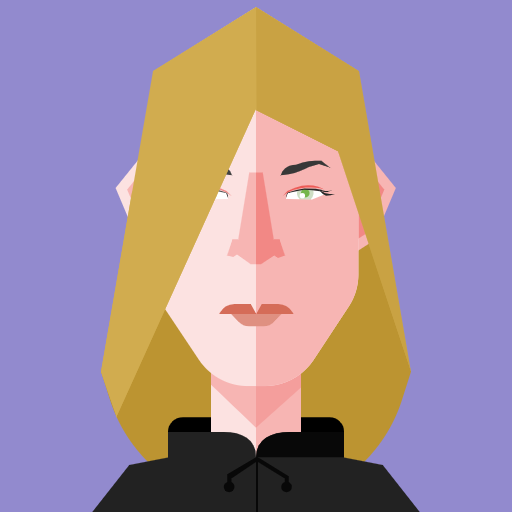

# 👋 Hi, I’m valeavoxl

🎨 **3D Modeler & Graphic Designer** | Specialized in Blender, Low/Mid-Poly Assets & Python Scripting (`bpy`).

- 👀 **Interests:** 3D modeling, environment & props design, digital illustration, traditional painting, photography & Python automation.
- 🌱 **Currently Working On:** Blender Python scripts for procedural generation, mid-poly asset creation, and open-source 2D/3D workflows.
- 💞️ **Looking to Collaborate On:** 3D asset pipelines, Blender add-ons/scripts, and creative IT projects.
- 📫 **How to reach me:** [v.dauphin83@gmail.com](mailto:v.dauphin83@gmail.com)

---

### 🛠️ Creative & Tech Stack

- **3D & Texturing:** Blender, Material Maker, ArmorPaint
- **2D & Vector:** Krita, Inkscape, GIMP, Photopea
- **Development & Scripting:** Python (`bpy`), HTML/CSS, Git/GitHub, Linux (Ubuntu Studio)
- **Platforms:** Sketchfab | CGTrader

